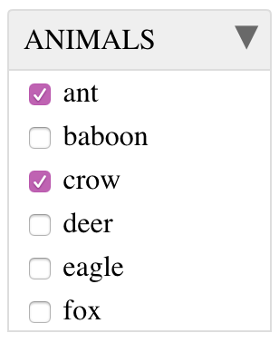

## Install
`git clone https://github.com/zdj/checkboxselect`

`npm install`

## Local development

### Start webpack dev server
`node_modules/.bin/webpack-dev-server`

[http://localhost:9000](http://localhost:9000)

### Build the distribution
`node_modules/.bin/webpack`

## Usage

### Basic usage using defaults

##### HTML

```HTML
<div class="js-checkbox-select-container"></div>
```

##### JS
```JS
const items = {item1: 1, item2: 2, item3: 3};
const selectedItemValues = [1,3];
new CheckboxSelect().init(items, selectedItemValues);
```

### Full example
```HTML
<!DOCTYPE html>
<html>
  <body>
    <div id="animals-container" class="js-checkbox-select-container" style="width: 160px;"></div>
    <script>
      document.addEventListener('DOMContentLoaded', () => {
        new CheckboxSelect({
          targetContainerId: 'animals-container',
          legend: 'ANIMALS',
          fieldName: 'animals[]',
          onItemSelected: item => { console.log(item) },
          onItemDeselected: item => { console.log(item) },
          collapsedIcon: '◀',
          expandedIcon: '▼',
          noItemsText: 'no animals found'
        }).init({
          'ant' : 1,
          'baboon': 2,
          'crow': 3,
          'deer': 4,
          'eagle': 5,
          'fox': 6,
          'goose': 7,
          'hare': 8,
          'iguana': 9,
          'jaguar': 10
        }, [1,3,9]);
      });
    </script>
  </body>
</html>
```

The example above would render:

*when open:*



*when closed:*


#### Use with data-* attributes

You can also use `data-*` attributes on the target container

## Options
|Name|Type|Default|Description|
|:--|:--:|:-----:|:---------|
|`targetContainerId`|{String}|If not provided, the first container element having the CSS class `js-checkbox-select-container` will be used instead.|The `id` attribute of the target container element.|
|`legend`|{String}|`ITEMS`|The caption that will be used for the `<fieldset>` element|
|`fieldName`|{String}|`items[]`|The `name` attribute of the `<input type="checkbox">` elements.|
|`noItemsText`|{String}|`No items found`|The text to display when there are no items.|
|`expandedIcon`|{String}|`▼`|The icon shown when the fieldset is expanded. This can be an HTML string such as a [Font Awesome](https://fontawesome.com) icon (e.g. `<i class="fas fa-caret-down"></i>`).|
|`collapsedIcon`|{String}|`◀`|The icon shown when the fieldset is collapsed. This can be an HTML string such as a [Font Awesome](https://fontawesome.com) icon (e.g. `<i class="fas fa-caret-left"></i>`).|
|`onItemSelected`|{Function}|`(item) => {}`|The function to be called when an item is selected. `item` is a key value pair of the name and value of the selected item (e.g. `{eagle: "5"}`).|
|`onItemDeselected`|{Function}|`(item) => {}`|The function to be called when an item is deselected. `item` is a key value pair of the name and value of the deselected item (e.g. `{eagle: "5"}`).|
